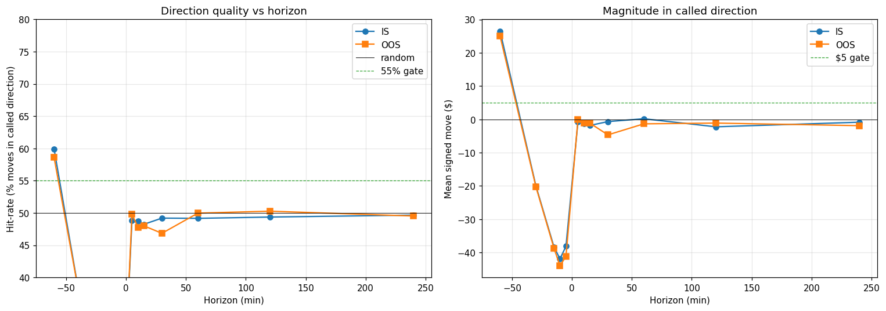

# RM Pivot — Signal Portfolio Dashboard (Cycle 03)

Generated: 2026-04-22T06:13:14
Ref: `research/rm_pivot/cycle_03.md`

**Big question**: can we trade the RM-pivot signal reliably enough?
Each sub-question below is a necessary component. All need to pass.

## Method

- RM zigzag at R=$4 (Cycle 1 sweet spot)
- At each confirmed pivot: LOW → LONG, HIGH → SHORT
- Horizons (min): [-60, -30, -15, -10, -5, 5, 10, 15, 30, 60, 120, 240] (negative = backward, positive = forward)
- signed_move = (price[entry+H] − entry_price) × dir_sign × $2/pt
- oracle_move = max favorable move within (entry, entry+H] × $2/pt (forward H only)
- EOD cutoff 20:55 UTC: pivots and horizons past it are dropped

## IS (2025)

### IS (2025) — Q1: Direction hit-rate at forward horizons

| H (min) | N | Hit-rate | Mean signed | Median | Gate |
|---:|---:|---:|---:|---:|---|
| +5 | 5820 | **48.8%** | $-0.74 | $-0.50 | ✗ |
| +10 | 5789 | **48.7%** | $-1.20 | $-1.00 | ✗ |
| +15 | 5744 | **48.2%** | $-1.82 | $-1.50 | ✗ |
| +30 | 5661 | **49.2%** | $-0.67 | $-1.00 | ✗ |
| +60 | 5500 | **49.2%** | $+0.19 | $-1.50 | ✗ |
| +120 | 5089 | **49.4%** | $-2.23 | $-2.00 | ✗ |
| +240 | 4307 | **49.7%** | $-0.85 | $-2.00 | ✗ |

### IS (2025) — Q2: Turning-point correctness at backward horizons

(Signed move at past = (past_price − entry_price) × dir. Should be NEGATIVE at a real reversal — we came AGAINST the called direction.)

| H (min) | N | % pre-trend against us | Mean signed (past) | Gate |
|---:|---:|---:|---:|---|
| -60 | 5856 | **40.1%** | $+26.52 | ✗ |
| -30 | 5856 | **72.4%** | $-20.10 | ✓ |
| -15 | 5856 | **86.9%** | $-38.31 | ✓ |
| -10 | 5856 | **90.6%** | $-41.91 | ✓ |
| -5 | 5856 | **90.6%** | $-38.12 | ✓ |

### IS (2025) — Q3: Mean $ captured at exit timing = horizon

(Just mean signed move at forward horizons — what you get if you exit exactly at H min.)

| H (min) | Mean $ | Median $ | Mean \|move\| | Gate ($5) |
|---:|---:|---:|---:|---|
| +5 | $-0.74 | $-0.50 | $28.93 | ✗ |
| +10 | $-1.20 | $-1.00 | $41.38 | ✗ |
| +15 | $-1.82 | $-1.50 | $51.00 | ✗ |
| +30 | $-0.67 | $-1.00 | $72.93 | ✗ |
| +60 | $+0.19 | $-1.50 | $102.50 | ✗ |
| +120 | $-2.23 | $-2.00 | $147.00 | ✗ |
| +240 | $-0.85 | $-2.00 | $215.90 | ✗ |

### IS (2025) — Q4: Oracle-best exit ceiling (perfect timing)

(For each pivot, max favorable price within (entry, entry+H]. Upper bound on what any exit rule can achieve.)

| H (min) | N | Mean oracle $ | Median oracle $ | P25 | P75 |
|---:|---:|---:|---:|---:|---:|
| +5 | 5820 | $+29.92 | $+18.00 | $+7.50 | $+36.50 |
| +10 | 5789 | $+41.96 | $+25.50 | $+11.00 | $+52.00 |
| +15 | 5744 | $+51.08 | $+31.00 | $+13.50 | $+63.50 |
| +30 | 5661 | $+73.46 | $+44.00 | $+20.50 | $+88.00 |
| +60 | 5500 | $+103.39 | $+62.50 | $+29.00 | $+128.00 |
| +120 | 5089 | $+147.57 | $+91.50 | $+41.50 | $+184.00 |
| +240 | 4307 | $+214.69 | $+132.50 | $+62.00 | $+280.25 |

### IS (2025) — Q5: Daily aggregation (signed move pooled by day)

For each day, sum signed_move across that day's pivots, per horizon.

| H (min) | n_days | DayWR (%days>0) | Daily mean | Daily median | Daily p25 | Daily p75 |
|---:|---:|---:|---:|---:|---:|---:|
| +5 | 231 | **46%** | $-18.61 | $-16.00 | $-108.50 | $+102.00 |
| +10 | 231 | **46%** | $-30.00 | $-16.50 | $-152.50 | $+110.75 |
| +15 | 231 | **43%** | $-45.29 | $-32.50 | $-179.25 | $+148.50 |
| +30 | 231 | **49%** | $-16.34 | $-1.50 | $-192.25 | $+174.00 |
| +60 | 231 | **47%** | $+4.42 | $-21.50 | $-204.75 | $+175.75 |
| +120 | 231 | **41%** | $-49.20 | $-64.50 | $-219.50 | $+125.00 |
| +240 | 231 | **47%** | $-15.86 | $-13.50 | $-199.50 | $+138.75 |

## OOS (2026)

### OOS (2026) — Q1: Direction hit-rate at forward horizons

| H (min) | N | Hit-rate | Mean signed | Median | Gate |
|---:|---:|---:|---:|---:|---|
| +5 | 1663 | **49.8%** | $-0.06 | $+0.00 | ✗ |
| +10 | 1655 | **47.8%** | $-1.03 | $-1.50 | ✗ |
| +15 | 1648 | **48.0%** | $-1.14 | $-2.00 | ✗ |
| +30 | 1631 | **46.8%** | $-4.66 | $-4.50 | ✗ |
| +60 | 1587 | **50.0%** | $-1.34 | $+0.00 | ✗ |
| +120 | 1480 | **50.3%** | $-1.12 | $+0.75 | ✗ |
| +240 | 1258 | **49.5%** | $-1.89 | $-3.75 | ✗ |

### OOS (2026) — Q2: Turning-point correctness at backward horizons

(Signed move at past = (past_price − entry_price) × dir. Should be NEGATIVE at a real reversal — we came AGAINST the called direction.)

| H (min) | N | % pre-trend against us | Mean signed (past) | Gate |
|---:|---:|---:|---:|---|
| -60 | 1669 | **41.4%** | $+25.02 | ✗ |
| -30 | 1671 | **71.8%** | $-20.35 | ✓ |
| -15 | 1672 | **87.0%** | $-38.71 | ✓ |
| -10 | 1672 | **91.3%** | $-43.97 | ✓ |
| -5 | 1672 | **91.4%** | $-41.15 | ✓ |

### OOS (2026) — Q3: Mean $ captured at exit timing = horizon

(Just mean signed move at forward horizons — what you get if you exit exactly at H min.)

| H (min) | Mean $ | Median $ | Mean \|move\| | Gate ($5) |
|---:|---:|---:|---:|---|
| +5 | $-0.06 | $+0.00 | $31.32 | ✗ |
| +10 | $-1.03 | $-1.50 | $42.68 | ✗ |
| +15 | $-1.14 | $-2.00 | $51.73 | ✗ |
| +30 | $-4.66 | $-4.50 | $74.14 | ✗ |
| +60 | $-1.34 | $+0.00 | $105.12 | ✗ |
| +120 | $-1.12 | $+0.75 | $155.83 | ✗ |
| +240 | $-1.89 | $-3.75 | $230.23 | ✗ |

### OOS (2026) — Q4: Oracle-best exit ceiling (perfect timing)

(For each pivot, max favorable price within (entry, entry+H]. Upper bound on what any exit rule can achieve.)

| H (min) | N | Mean oracle $ | Median oracle $ | P25 | P75 |
|---:|---:|---:|---:|---:|---:|
| +5 | 1663 | $+30.41 | $+20.00 | $+8.50 | $+40.00 |
| +10 | 1655 | $+42.27 | $+28.50 | $+12.25 | $+54.50 |
| +15 | 1648 | $+51.95 | $+34.25 | $+15.50 | $+68.00 |
| +30 | 1631 | $+72.94 | $+48.00 | $+22.50 | $+97.50 |
| +60 | 1587 | $+103.23 | $+68.00 | $+32.50 | $+137.00 |
| +120 | 1480 | $+148.37 | $+99.50 | $+44.00 | $+202.62 |
| +240 | 1258 | $+215.21 | $+156.00 | $+61.50 | $+301.88 |

### OOS (2026) — Q5: Daily aggregation (signed move pooled by day)

For each day, sum signed_move across that day's pivots, per horizon.

| H (min) | n_days | DayWR (%days>0) | Daily mean | Daily median | Daily p25 | Daily p75 |
|---:|---:|---:|---:|---:|---:|---:|
| +5 | 56 | **57%** | $-1.63 | $+64.25 | $-138.88 | $+143.38 |
| +10 | 56 | **52%** | $-30.32 | $+7.75 | $-188.75 | $+140.38 |
| +15 | 56 | **48%** | $-33.53 | $-7.75 | $-191.25 | $+193.38 |
| +30 | 56 | **43%** | $-135.72 | $-45.25 | $-364.62 | $+152.50 |
| +60 | 56 | **48%** | $-37.99 | $-12.50 | $-325.88 | $+233.88 |
| +120 | 56 | **48%** | $-29.51 | $-42.25 | $-268.25 | $+259.50 |
| +240 | 56 | **52%** | $-42.44 | $+6.00 | $-267.88 | $+224.38 |

## Signal Portfolio Dashboard — Can we trade reliably enough?

| Sub-question | Metric (best across horizons) | IS | OOS | Gate | IS✓ | OOS✓ |
|---|---|---:|---:|---|:---:|:---:|
| Q1 Direction right? | hit-rate % | 49.7% | 50.3% | ≥55% at 2+ H | ✗ | ✗ |
| Q2 Real turning point? | pre-trend-against-us % | 90.6% | 91.4% | ≥55% at 2+ H | ✓ | ✓ |
| Q3 Enough $ per trade? | mean signed $ | $+0.19 | $-0.06 | ≥$5 at 1+ H | ✗ | ✗ |
| Q4 Oracle-exit ceiling | mean max-favorable $ | $+214.69 | $+215.21 | ≥$20 | ✓ | ✓ |
| Q5 Signal stacks by day? | best DayWR | 49% | 57% | ≥60% | ✗ | ✗ |

**IS portfolio**: 2/5 gates pass
**OOS portfolio**: 2/5 gates pass

**Verdict: MARGINAL** — signal exists but edge is thin. Investigate which sub-questions fail and whether they can be filtered.

## Reproduction

```
python tools/measure_rm_pivot_entry_direction.py
```

## Chart


