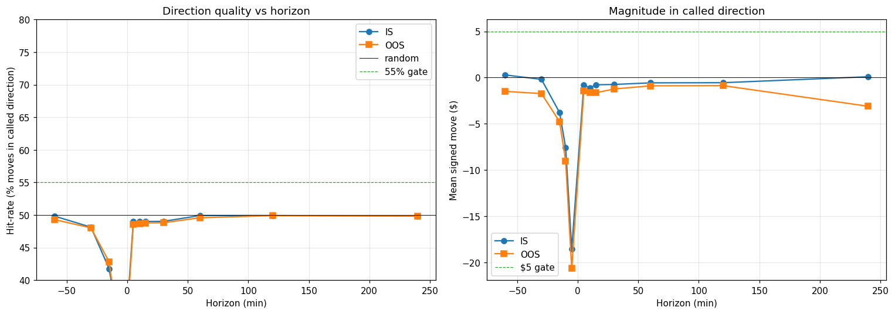

# RM Pivot — Signal Portfolio Dashboard (Cycle 03)

Generated: 2026-04-22T06:16:33
Ref: `research/rm_pivot/cycle_03.md`

**Big question**: can we trade the RM-pivot signal reliably enough?
Each sub-question below is a necessary component. All need to pass.

## Method

- RM zigzag at R=$40 (Cycle 1 sweet spot)
- At each confirmed pivot: LOW → LONG, HIGH → SHORT
- Horizons (min): [-60, -30, -15, -10, -5, 5, 10, 15, 30, 60, 120, 240] (negative = backward, positive = forward)
- signed_move = (price[entry+H] − entry_price) × dir_sign × $2/pt
- oracle_move = max favorable move within (entry, entry+H] × $2/pt (forward H only)
- EOD cutoff 20:55 UTC: pivots and horizons past it are dropped

## IS (2025)

### IS (2025) — Q1: Direction hit-rate at forward horizons

| H (min) | N | Hit-rate | Mean signed | Median | Gate |
|---:|---:|---:|---:|---:|---|
| +5 | 11762 | **49.0%** | $-0.77 | $-1.00 | ✗ |
| +10 | 11717 | **49.0%** | $-1.13 | $-1.00 | ✗ |
| +15 | 11682 | **49.0%** | $-0.78 | $-1.50 | ✗ |
| +30 | 11521 | **49.0%** | $-0.74 | $-2.00 | ✗ |
| +60 | 11088 | **49.9%** | $-0.57 | $+0.00 | ✗ |
| +120 | 10092 | **49.9%** | $-0.55 | $+0.00 | ✗ |
| +240 | 8103 | **49.8%** | $+0.09 | $-1.00 | ✗ |

### IS (2025) — Q2: Turning-point correctness at backward horizons

(Signed move at past = (past_price − entry_price) × dir. Should be NEGATIVE at a real reversal — we came AGAINST the called direction.)

| H (min) | N | % pre-trend against us | Mean signed (past) | Gate |
|---:|---:|---:|---:|---|
| -60 | 11700 | **50.2%** | $+0.29 | ✗ |
| -30 | 11788 | **51.9%** | $-0.19 | ✗ |
| -15 | 11820 | **58.2%** | $-3.80 | ✓ |
| -10 | 11823 | **63.6%** | $-7.59 | ✓ |
| -5 | 11837 | **78.0%** | $-18.57 | ✓ |

### IS (2025) — Q3: Mean $ captured at exit timing = horizon

(Just mean signed move at forward horizons — what you get if you exit exactly at H min.)

| H (min) | Mean $ | Median $ | Mean \|move\| | Gate ($5) |
|---:|---:|---:|---:|---|
| +5 | $-0.77 | $-1.00 | $44.75 | ✗ |
| +10 | $-1.13 | $-1.00 | $62.93 | ✗ |
| +15 | $-0.78 | $-1.50 | $76.84 | ✗ |
| +30 | $-0.74 | $-2.00 | $104.48 | ✗ |
| +60 | $-0.57 | $+0.00 | $147.27 | ✗ |
| +120 | $-0.55 | $+0.00 | $206.56 | ✗ |
| +240 | $+0.09 | $-1.00 | $287.35 | ✗ |

### IS (2025) — Q4: Oracle-best exit ceiling (perfect timing)

(For each pivot, max favorable price within (entry, entry+H]. Upper bound on what any exit rule can achieve.)

| H (min) | N | Mean oracle $ | Median oracle $ | P25 | P75 |
|---:|---:|---:|---:|---:|---:|
| +5 | 11762 | $+45.05 | $+29.00 | $+12.50 | $+58.50 |
| +10 | 11717 | $+63.18 | $+40.50 | $+17.00 | $+81.50 |
| +15 | 11682 | $+77.09 | $+49.50 | $+21.00 | $+100.00 |
| +30 | 11521 | $+107.29 | $+69.00 | $+29.50 | $+139.50 |
| +60 | 11088 | $+149.42 | $+97.50 | $+43.50 | $+192.50 |
| +120 | 10092 | $+208.01 | $+136.00 | $+61.00 | $+273.50 |
| +240 | 8103 | $+292.22 | $+187.00 | $+82.50 | $+379.75 |

### IS (2025) — Q5: Daily aggregation (signed move pooled by day)

For each day, sum signed_move across that day's pivots, per horizon.

| H (min) | n_days | DayWR (%days>0) | Daily mean | Daily median | Daily p25 | Daily p75 |
|---:|---:|---:|---:|---:|---:|---:|
| +5 | 225 | **46%** | $-40.12 | $-21.50 | $-209.50 | $+99.50 |
| +10 | 225 | **44%** | $-58.88 | $-44.00 | $-193.00 | $+120.50 |
| +15 | 225 | **40%** | $-40.58 | $-53.00 | $-224.00 | $+110.00 |
| +30 | 225 | **43%** | $-38.11 | $-44.50 | $-223.50 | $+150.00 |
| +60 | 225 | **47%** | $-28.16 | $-26.50 | $-194.00 | $+121.50 |
| +120 | 225 | **42%** | $-24.88 | $-42.00 | $-187.00 | $+144.50 |
| +240 | 225 | **45%** | $+3.37 | $-43.00 | $-206.00 | $+185.00 |

## OOS (2026)

### OOS (2026) — Q1: Direction hit-rate at forward horizons

| H (min) | N | Hit-rate | Mean signed | Median | Gate |
|---:|---:|---:|---:|---:|---|
| +5 | 3835 | **48.6%** | $-1.46 | $-1.00 | ✗ |
| +10 | 3821 | **48.7%** | $-1.62 | $-1.50 | ✗ |
| +15 | 3801 | **48.8%** | $-1.64 | $-2.00 | ✗ |
| +30 | 3755 | **48.8%** | $-1.24 | $-3.00 | ✗ |
| +60 | 3645 | **49.6%** | $-0.89 | $-1.50 | ✗ |
| +120 | 3405 | **49.9%** | $-0.87 | $+0.00 | ✗ |
| +240 | 2848 | **49.9%** | $-3.11 | $-1.00 | ✗ |

### OOS (2026) — Q2: Turning-point correctness at backward horizons

(Signed move at past = (past_price − entry_price) × dir. Should be NEGATIVE at a real reversal — we came AGAINST the called direction.)

| H (min) | N | % pre-trend against us | Mean signed (past) | Gate |
|---:|---:|---:|---:|---|
| -60 | 3802 | **50.7%** | $-1.49 | ✗ |
| -30 | 3838 | **52.0%** | $-1.74 | ✗ |
| -15 | 3856 | **57.2%** | $-4.78 | ✓ |
| -10 | 3860 | **64.0%** | $-9.05 | ✓ |
| -5 | 3864 | **80.0%** | $-20.65 | ✓ |

### OOS (2026) — Q3: Mean $ captured at exit timing = horizon

(Just mean signed move at forward horizons — what you get if you exit exactly at H min.)

| H (min) | Mean $ | Median $ | Mean \|move\| | Gate ($5) |
|---:|---:|---:|---:|---|
| +5 | $-1.46 | $-1.00 | $40.43 | ✗ |
| +10 | $-1.62 | $-1.50 | $56.47 | ✗ |
| +15 | $-1.64 | $-2.00 | $67.80 | ✗ |
| +30 | $-1.24 | $-3.00 | $93.60 | ✗ |
| +60 | $-0.89 | $-1.50 | $133.48 | ✗ |
| +120 | $-0.87 | $+0.00 | $185.85 | ✗ |
| +240 | $-3.11 | $-1.00 | $252.89 | ✗ |

### OOS (2026) — Q4: Oracle-best exit ceiling (perfect timing)

(For each pivot, max favorable price within (entry, entry+H]. Upper bound on what any exit rule can achieve.)

| H (min) | N | Mean oracle $ | Median oracle $ | P25 | P75 |
|---:|---:|---:|---:|---:|---:|
| +5 | 3835 | $+39.73 | $+28.50 | $+12.50 | $+53.50 |
| +10 | 3821 | $+55.75 | $+39.00 | $+18.00 | $+76.00 |
| +15 | 3801 | $+67.96 | $+48.50 | $+22.00 | $+92.00 |
| +30 | 3755 | $+95.02 | $+68.00 | $+31.50 | $+129.50 |
| +60 | 3645 | $+131.62 | $+97.00 | $+43.50 | $+179.00 |
| +120 | 3405 | $+181.76 | $+135.50 | $+62.50 | $+251.00 |
| +240 | 2848 | $+247.70 | $+191.50 | $+85.00 | $+361.62 |

### OOS (2026) — Q5: Daily aggregation (signed move pooled by day)

For each day, sum signed_move across that day's pivots, per horizon.

| H (min) | n_days | DayWR (%days>0) | Daily mean | Daily median | Daily p25 | Daily p75 |
|---:|---:|---:|---:|---:|---:|---:|
| +5 | 56 | **41%** | $-99.70 | $-96.50 | $-361.88 | $+178.12 |
| +10 | 56 | **38%** | $-110.57 | $-120.50 | $-321.38 | $+90.75 |
| +15 | 56 | **41%** | $-111.24 | $-91.75 | $-408.38 | $+124.25 |
| +30 | 56 | **45%** | $-82.84 | $-48.00 | $-335.75 | $+160.88 |
| +60 | 56 | **39%** | $-58.21 | $-84.00 | $-297.88 | $+201.12 |
| +120 | 56 | **45%** | $-52.91 | $-64.50 | $-335.38 | $+139.12 |
| +240 | 56 | **34%** | $-157.96 | $-97.75 | $-370.88 | $+70.50 |

## Signal Portfolio Dashboard — Can we trade reliably enough?

| Sub-question | Metric (best across horizons) | IS | OOS | Gate | IS✓ | OOS✓ |
|---|---|---:|---:|---|:---:|:---:|
| Q1 Direction right? | hit-rate % | 49.9% | 49.9% | ≥55% at 2+ H | ✗ | ✗ |
| Q2 Real turning point? | pre-trend-against-us % | 78.0% | 80.0% | ≥55% at 2+ H | ✓ | ✓ |
| Q3 Enough $ per trade? | mean signed $ | $+0.09 | $-0.87 | ≥$5 at 1+ H | ✗ | ✗ |
| Q4 Oracle-exit ceiling | mean max-favorable $ | $+292.22 | $+247.70 | ≥$20 | ✓ | ✓ |
| Q5 Signal stacks by day? | best DayWR | 47% | 45% | ≥60% | ✗ | ✗ |

**IS portfolio**: 2/5 gates pass
**OOS portfolio**: 2/5 gates pass

**Verdict: MARGINAL** — signal exists but edge is thin. Investigate which sub-questions fail and whether they can be filtered.

## Reproduction

```
python tools/measure_rm_pivot_entry_direction.py
```

## Chart


