# Stage 1 (Corrected): True Oscillation Reconciliation

**Goal**: Find the real oscillation structure per TF *without imposing a frequency*.

## Reconciliation Table
| TF | Event Count (N=40) | Cubic Plateau (Mins) | Spectral Dominant (Mins) | ACF Trough (Mins) | Artifact Slope (Bars) | Verdict |
| --- | --- | --- | --- | --- | --- | --- |
| 5s | 107851 | Artifact | Broadband | 0.08 | 0.86 | TURN-RELATIVE (No Cadence) |
| 15s | 41738 | Artifact | Broadband | 0.25 | 0.82 | TURN-RELATIVE (No Cadence) |
| 1m | 12503 | Artifact | Broadband | 1.00 | 0.67 | TURN-RELATIVE (No Cadence) |
| 5m | 2528 | Artifact | Broadband | 5.00 | 0.66 | TURN-RELATIVE (No Cadence) |
| 15m | 839 | Artifact | Broadband | 15.00 | 0.66 | TURN-RELATIVE (No Cadence) |
| 1h | 265 | Artifact | Broadband | 60.00 | 0.48 | TURN-RELATIVE (No Cadence) |

## Details per Timeframe

### 5s Analysis
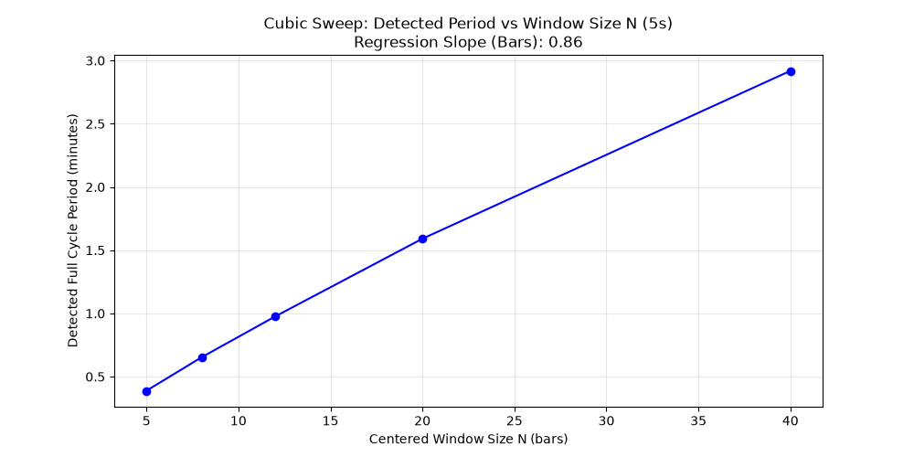
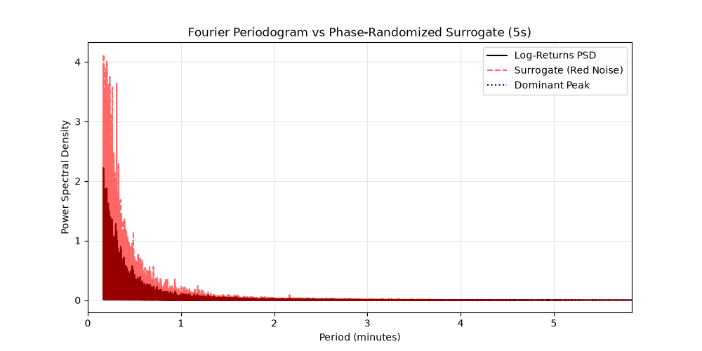

### 15s Analysis
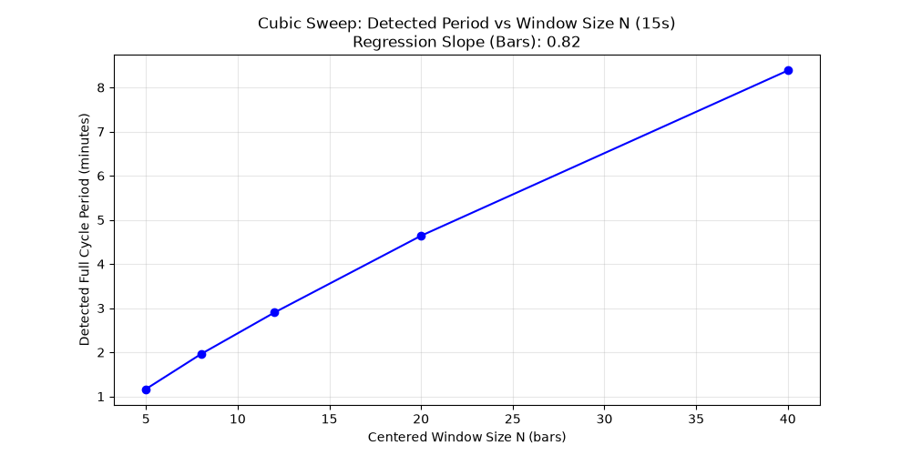
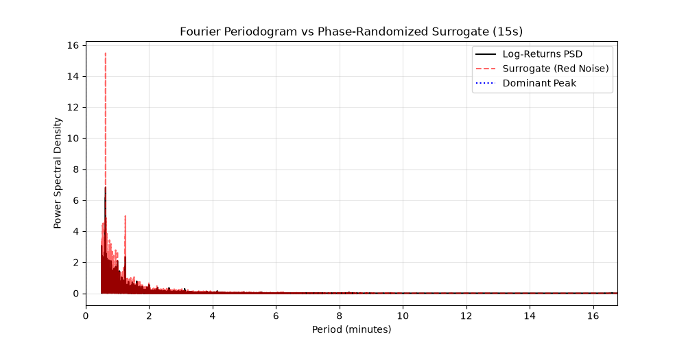

### 1m Analysis

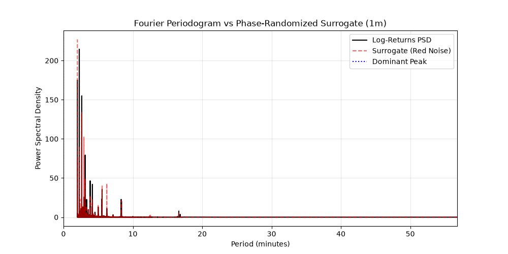

### 5m Analysis
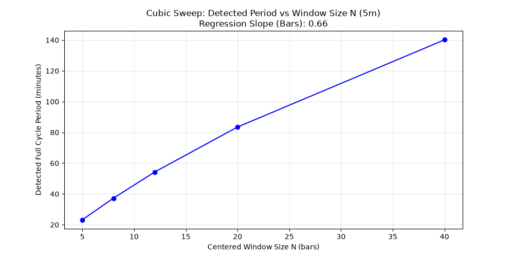
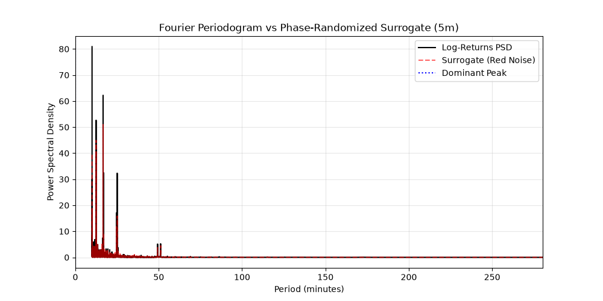

### 15m Analysis
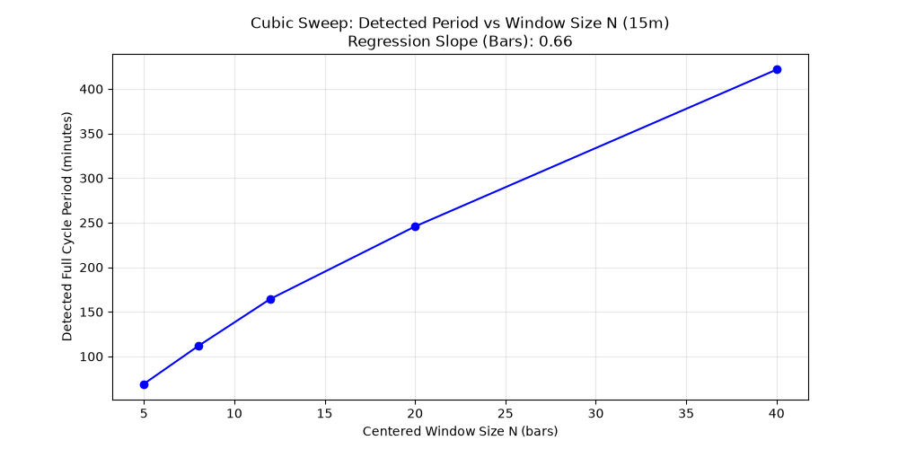
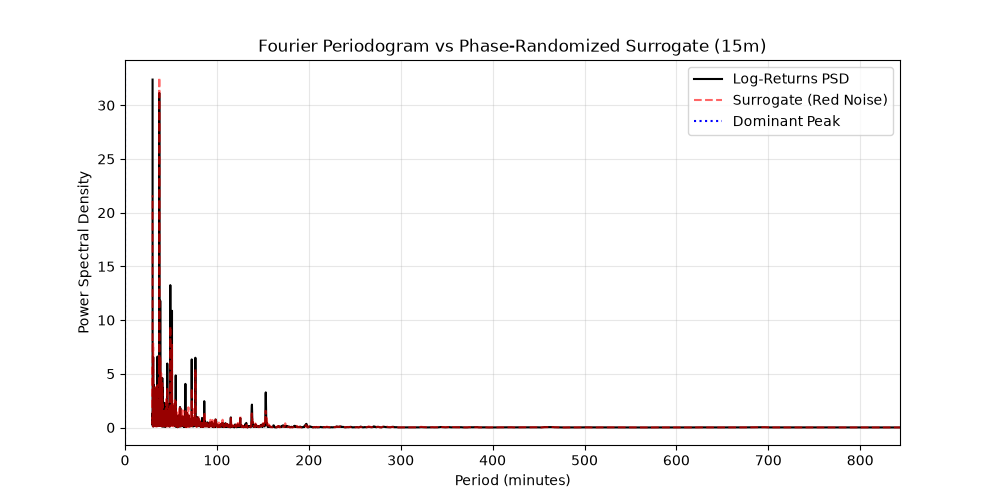

### 1h Analysis
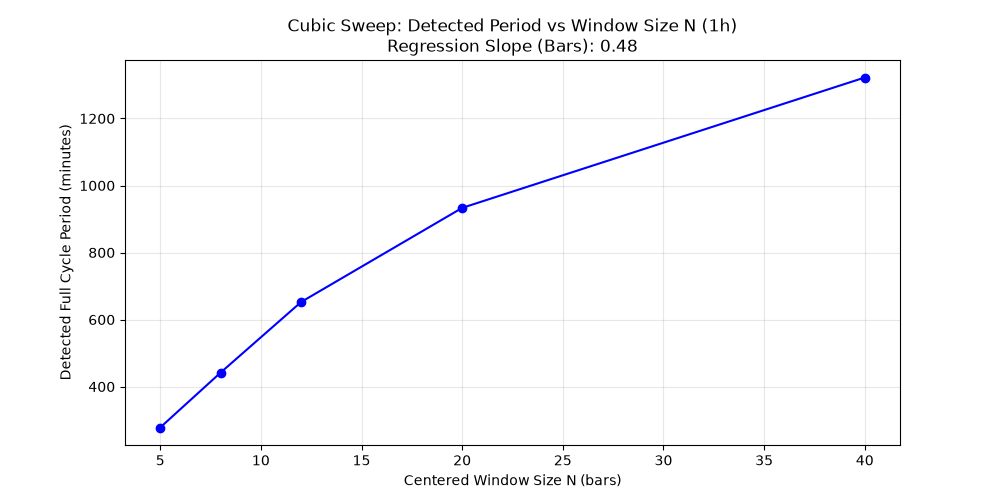
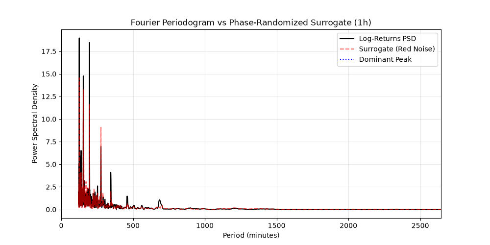
